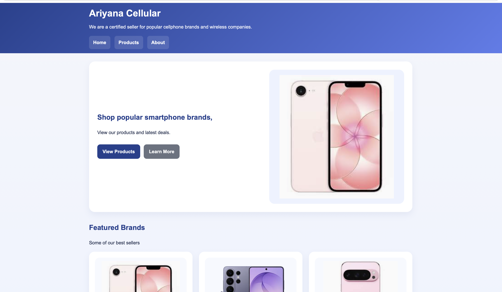

# Telecom Management System

A responsive telecommunications web application designed to provide a consistent and accessible user experience across desktop, tablet, and mobile devices.

### 🌐 [View Live Demo](https://ariyanaperkins392-sys.github.io/telecom-management-web-app/)

## Overview

The Telecom Management System is a responsive web application developed to demonstrate frontend development, responsive design, and user-interface architecture for a fictional telecommunications company.

The project evolved from an earlier fixed-layout implementation into a fully responsive application using semantic HTML, flexible CSS layouts, JavaScript-powered mobile navigation, responsive images, and media queries.

## Screenshots

### Desktop View

### Mobile View

### Mobile Navigation

## Tech Stack

- HTML5
- CSS3
- JavaScript
- Responsive Web Design
- CSS Grid / Flexible Layouts
- Media Queries
- Accessibility attributes

## Key Features

- Responsive layouts for desktop, tablet, and mobile devices
- Mobile navigation menu powered by JavaScript
- Semantic HTML structure
- Responsive product images
- Flexible page containers
- Device-specific breakpoints
- Accessible navigation using `aria-expanded`
- Adaptive product grids and content sections

## Responsive Design Improvements

### Semantic HTML

The original layout relied heavily on generic `
` elements.

The updated version introduced more semantic elements including:

- `<header>`
- `<main>`
- `<section>`

This improved both page organization and maintainability.

### Flexible Layouts

Fixed-width elements were replaced with flexible sizing such as:

`width: min(92%, 1100px);`

This allows content to resize naturally across different screen sizes.

### Mobile Navigation

JavaScript was added to control a collapsible navigation menu on smaller screens.

The menu:

- detects user interaction
- toggles navigation visibility
- updates the `aria-expanded` accessibility attribute

### Responsive Images

Images were updated to scale within their containers using:

`max-width: 100%;`
`height: auto;`

Multiple image sizes were also incorporated so smaller devices can load appropriately sized assets.

### Media Queries

Responsive breakpoints were implemented at:

- 900px
- 700px
- 480px

These breakpoints progressively adjust layouts, navigation, cards, typography, and other interface elements for smaller displays.

## What I Learned

This project helped me understand how responsive design requires more than shrinking elements on a page.

I gained hands-on experience restructuring HTML, replacing fixed CSS dimensions with flexible layouts, implementing responsive images, creating JavaScript-driven navigation, using accessibility attributes, and designing layouts around multiple viewport sizes.

## Future Improvements

Potential future improvements include:

- Backend API integration
- Database connectivity
- User authentication
- Automated responsive testing
- Improved accessibility testing
- Additional interactive functionality
